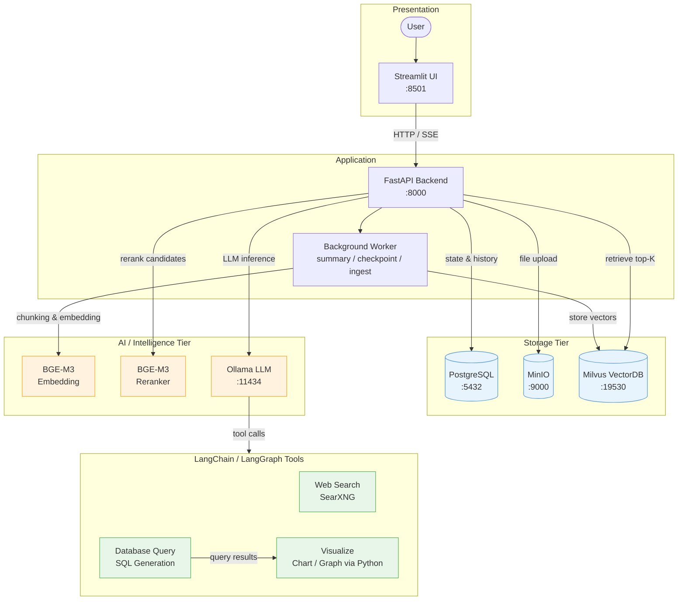
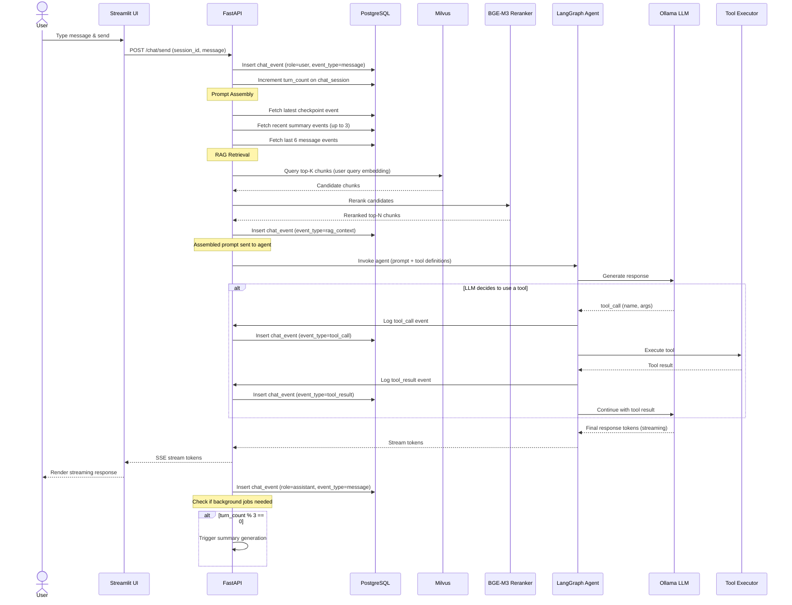
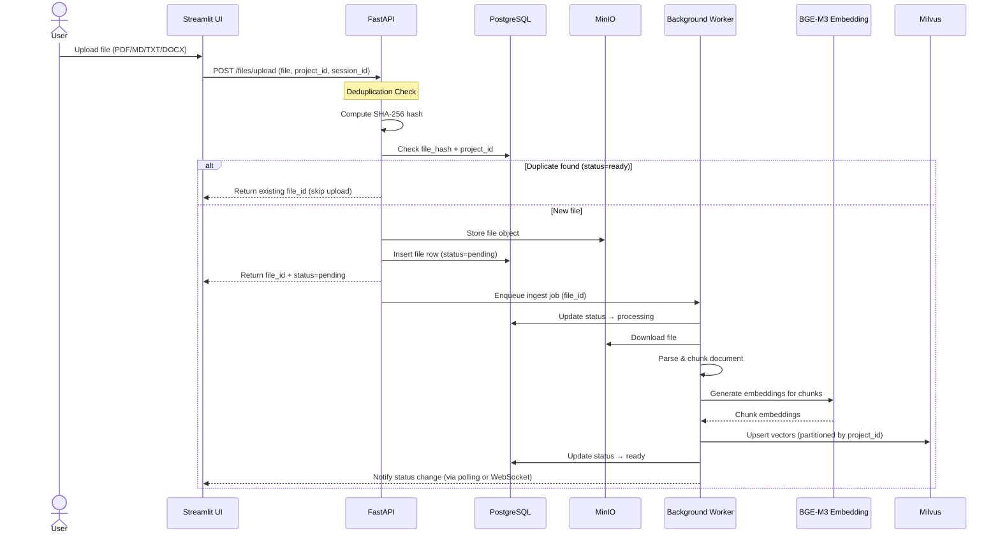
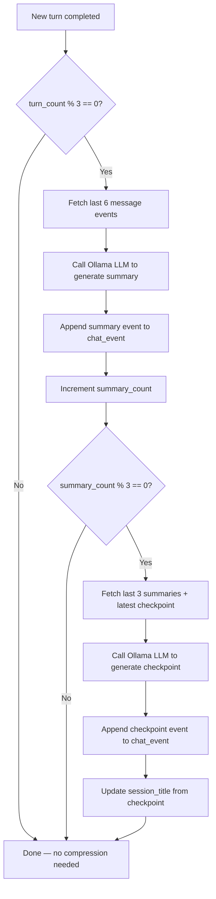
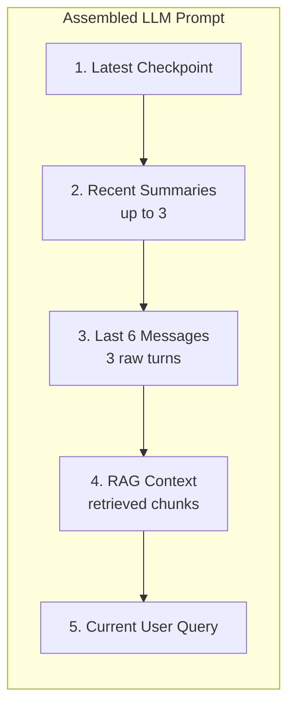
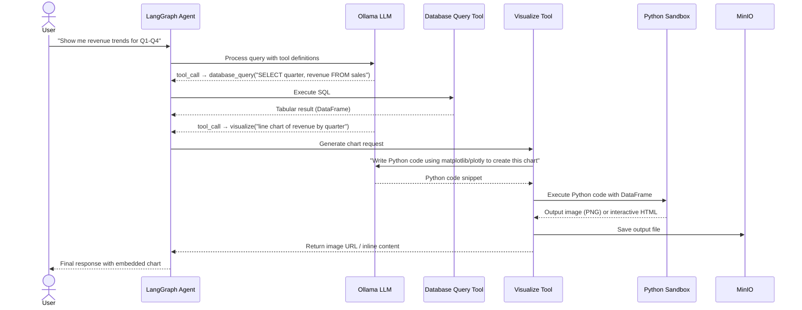
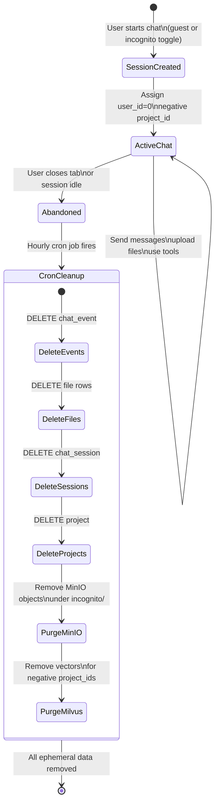
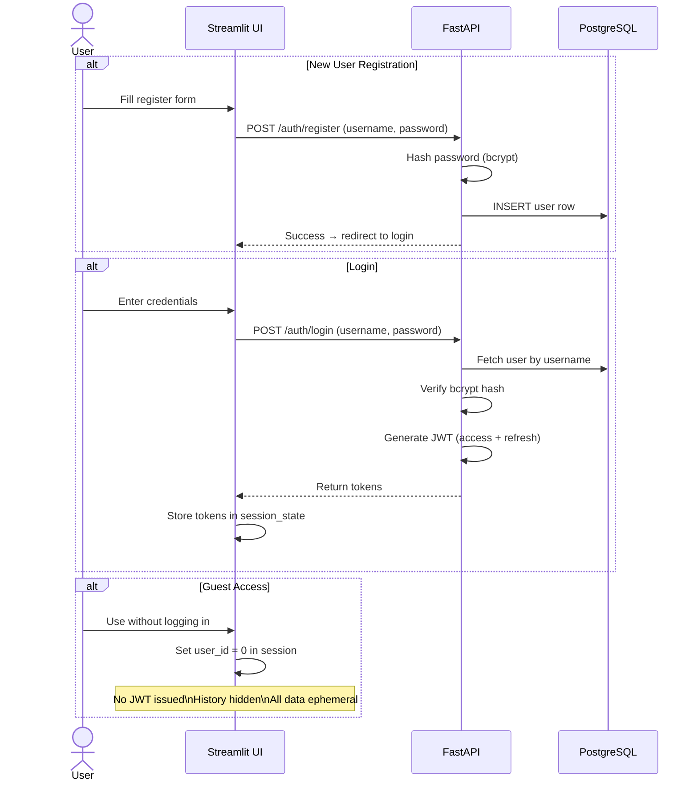
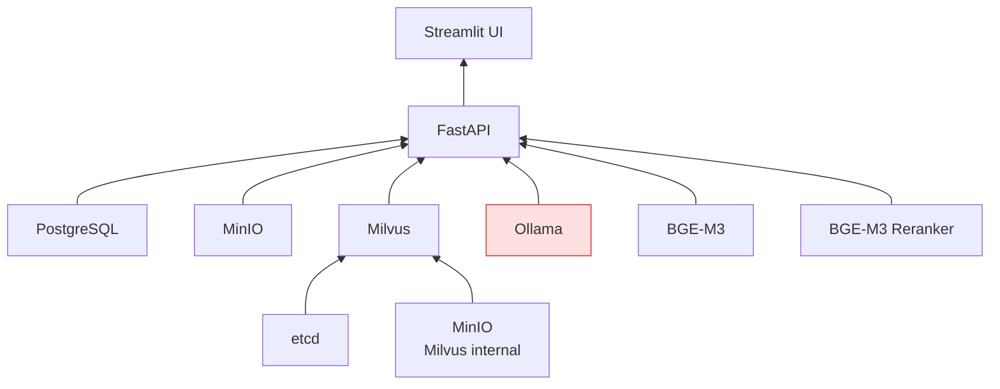

# FinHouse — System Flows

This document describes the key operational flows of the FinHouse platform using Mermaid diagrams.

---

## 1. Overall System Architecture

---

## 2. Chat Message Flow (with RAG & Tools)

This is the main flow when a user sends a message.

---

## 3. File Upload & Ingest Pipeline

---

## 4. Context Compression (Summary & Checkpoint)

**Prompt window at inference time:**

---

## 5. Visualization Tool Flow (Chart/Graph Generation)

When a user asks about trends or data that benefits from a visual:

**Supported Python libraries for visualization:**
- `matplotlib` + `seaborn` — static charts (bar, line, scatter, heatmap, histogram)
- `plotly` — interactive charts rendered as HTML widgets in the Streamlit UI

---

## 6. Guest / Incognito Session Lifecycle

---

## 7. Authentication Flow

---

## 8. Docker Container Dependency Graph

---

## Summary of Key Flows

| Flow | Trigger | Key Components |
|------|---------|----------------|
| Chat message | User sends message | UI → API → PG → Milvus → Reranker → LangGraph → Ollama → SSE |
| File upload | User uploads document | UI → API → MinIO → Background Worker → BGE-M3 → Milvus |
| Summary generation | Every 3 turns | Background Worker → PG → Ollama → PG |
| Checkpoint generation | Every 3 summaries | Background Worker → PG → Ollama → PG |
| Visualization | User asks for chart/trend | LangGraph → DB Query → Ollama (code gen) → Python Sandbox → MinIO |
| Ephemeral cleanup | Hourly cron | Cron → PG (cascade delete) → MinIO → Milvus |